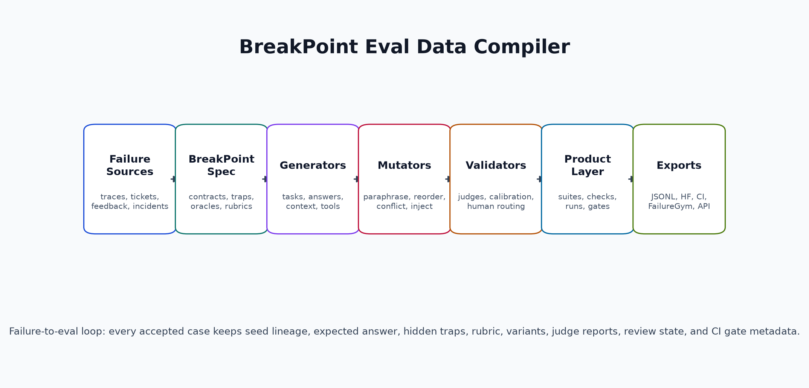
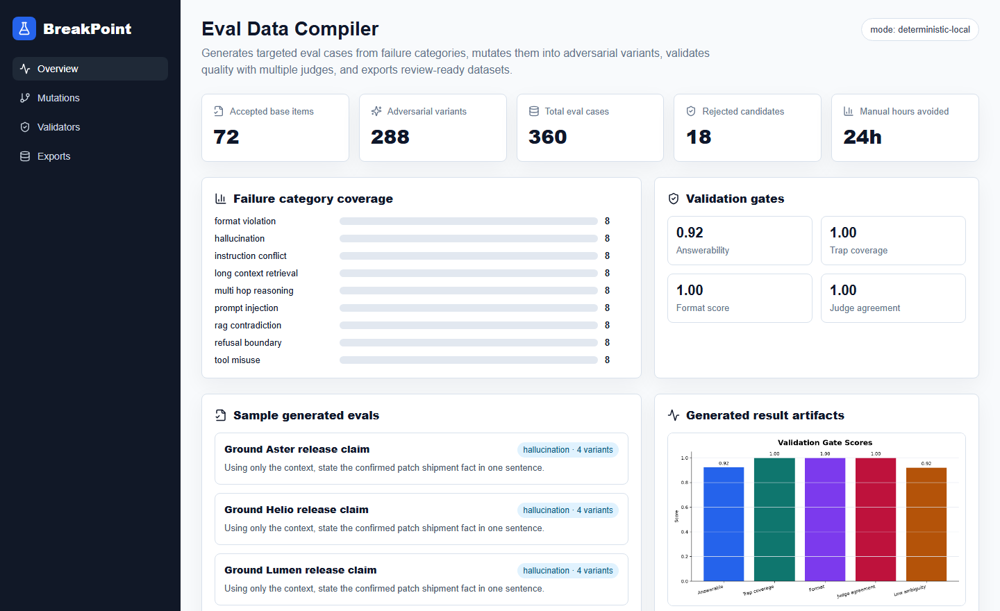
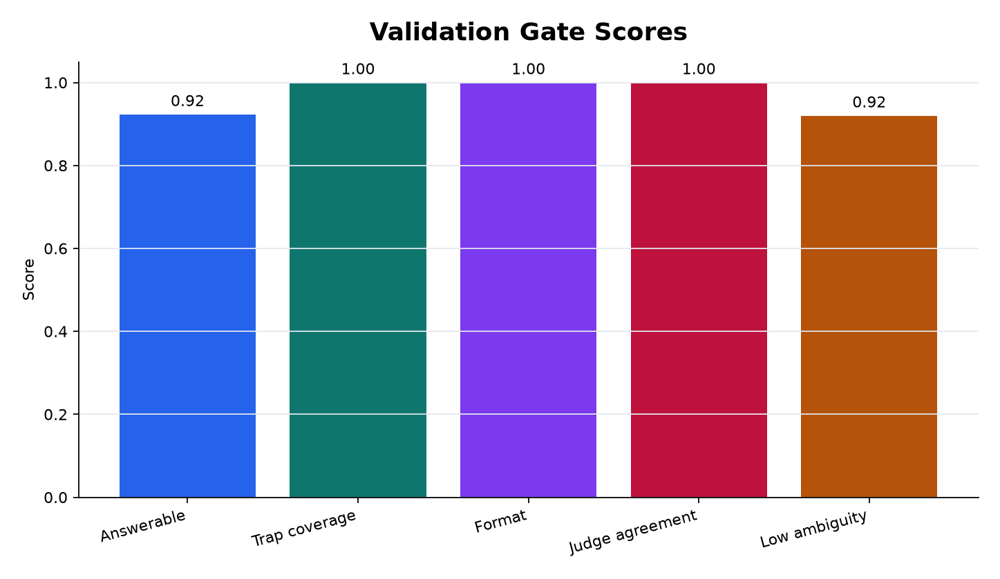
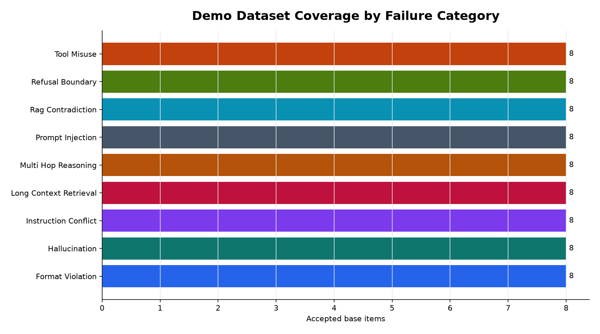
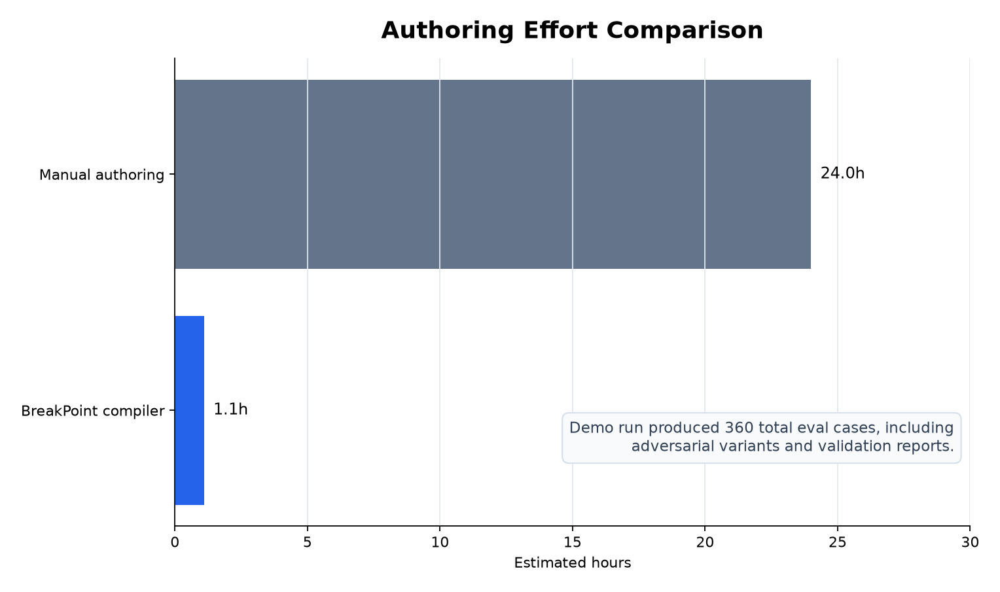

# BreakPoint

BreakPoint is an eval data compiler for LLM behavior. It generates targeted cases from real failure modes, adds hidden traps and rubrics, mutates prompts into adversarial variants, validates candidates with multiple judges, and exports high-quality datasets for evaluation runners.

The v0.2 direction is now implemented locally: BreakPoint can ingest failure traces, draft BreakPointSpec YAML, compile cases and variants, create product-layer suites/runs/checks, route human review, produce compiler-native metrics, generate CI regression reports, and package BreakPoint-FailureGym tracks.



## What It Builds

- Failure categories for hallucination, instruction conflict, multi-hop reasoning, tool misuse, long-context retrieval, refusal boundaries, format violations, RAG contradictions, and prompt injection.
- Generated tasks with expected answers, hidden traps, grading rubrics, and adversarial variants.
- Validation gates for ambiguity, answerability, trap coverage, schema compliance, and judge agreement.
- Product-layer objects for projects, dataset versions, eval suites, eval cases, checks, runs, model outputs, judgments, human reviews, failure clusters, and regression gates.
- BreakPointSpec YAML for declarative failure-family compilation.
- Trace2Eval ingestion for RAG logs, tool traces, user feedback, support tickets, red-team transcripts, and incident reports.
- Tool, retrieval, and agent simulators for controlled stale, malformed, contradictory, injected, missing-evidence, and invalid-trace conditions.
- Exports to JSONL, Hugging Face rows, DuckDB, OpenAI Evals-style YAML, lm-eval task YAML, CI reports, FailureGym tracks, FastAPI, and a Next.js dashboard.
- A LaTeX-generated system design PDF at `output/pdf/breakpoint_system_design.pdf` after running the build script. The generated PDF path is ignored by Git.

## Quickstart

```powershell
python -m venv .venv
.\.venv\Scripts\python -m pip install -r requirements-dev.txt
.\.venv\Scripts\python scripts/create_demo_artifacts.py
.\.venv\Scripts\python -m pytest
```

Generate a dataset directly:

```powershell
.\.venv\Scripts\python -m breakpoint_eval.cli compile --items-per-category 8 --variants-per-item 4 --hf-preview
```

Run the v0.2 failure-to-eval workflows:

```powershell
.\.venv\Scripts\python -m breakpoint_eval.cli compile-spec
.\.venv\Scripts\python -m breakpoint_eval.cli trace2eval
.\.venv\Scripts\python -m breakpoint_eval.cli product-demo
.\.venv\Scripts\python -m breakpoint_eval.cli ci-report
.\.venv\Scripts\python -m breakpoint_eval.cli failuregym
```

Run the API:

```powershell
.\.venv\Scripts\python -m breakpoint_eval.cli serve --port 8000
```

Run the dashboard:

```powershell
cd dashboard
npm install
npm run dev
```

## Dashboard Screenshot



## Demo Outputs

The demo artifact run writes:

- `artifacts/demo/breakpoint_eval.jsonl`
- `artifacts/demo/cases.jsonl`
- `artifacts/demo/product.json`
- `artifacts/demo/ci_report.json`
- `artifacts/demo/openai_evals.yaml`
- `artifacts/demo/lm_eval_task.yaml`
- `artifacts/demo/metrics.json`
- `artifacts/demo/preview.json`
- `artifacts/demo/api_output.json`
- `artifacts/demo/run_output.txt`
- `artifacts/specs/rag_freshness_contradiction.yaml`
- `artifacts/trace2eval/results.json`
- `artifacts/failuregym/manifest.json`

Example run output:

```text
dataset_id=breakpoint-3c7caa567536
accepted_items=72
adversarial_variants=288
total_eval_cases=360
rejected_candidates=18
acceptance_rate=0.8
```

Example API output:

```json
{
  "GET /health": {
    "status": "ok",
    "service": "BreakPoint",
    "mode": "deterministic-local"
  },
  "POST /compile": {
    "dataset_id": "breakpoint-3c7caa567536",
    "accepted_items": 72,
    "total_eval_cases": 360,
    "preview_category": "hallucination"
  }
}
```

## Results and Graphs







## Comparison

| Approach | Strength | Weakness |
| --- | --- | --- |
| Manual prompt writing | Human judgment and domain nuance | Slow, inconsistent, hard to mutate at scale |
| Static benchmark | Stable comparison point | Quickly goes stale and under-covers edge cases |
| BreakPoint compiler | Scalable targeted generation with validation and mutation | Needs strong category specs and production model judges for highest assurance |

## How the Compiler Works

1. Load the failure taxonomy.
2. Generate candidate eval items with task, context, answer, trap, and rubric.
3. Mutate each candidate with irrelevant context, reordered facts, renamed entities, paraphrased instructions, or conflicting evidence.
4. Validate candidates with multiple judge adapters.
5. Filter ambiguous or low-quality items.
6. Wrap accepted items as product-layer eval cases, checks, suites, runs, reviews, clusters, and gates.
7. Export accepted rows to JSONL, Hugging Face Datasets, DuckDB, OpenAI Evals, lm-eval, CI reports, FailureGym, API responses, and dashboard artifacts.

The local demo uses deterministic surrogate judges so tests are repeatable without API keys. The `breakpoint_eval.orchestration` module includes a LangGraph-compatible entry point, and the validation interface is ready for DSPy/LangChain model calls.

## Stack Mapping

| Stack item | Implementation |
| --- | --- |
| Python | Core compiler, validators, storage, CLI |
| DSPy | Adapter seam for generator and judge optimization |
| LangChain/LangGraph | Optional graph orchestration in `breakpoint_eval/orchestration.py` |
| Hugging Face datasets | `to_huggingface_dataset()` export helper |
| Pydantic | Typed eval item, rubric, trap, and validation schemas |
| DuckDB/PostgreSQL | DuckDB implemented locally; PostgreSQL planned as shared deployment store |
| FAISS/Qdrant | Local hash vector index implemented; FAISS/Qdrant optional dependencies |
| MinIO/S3 | Artifact storage interface documented for deployment |
| FastAPI | `breakpoint_eval.api:app` |
| Next.js | `dashboard/` |
| OpenAI/Anthropic/Gemini/vLLM | Judge adapter classes, enabled when credentials/endpoints are configured |

## LaTeX PDF

Build the detailed PDF:

```powershell
.\scripts\build_pdf.ps1
```

The final PDF is generated at `output/pdf/breakpoint_system_design.pdf`. It is intentionally covered by `.gitignore`; the editable source is `docs/latex/breakpoint_whitepaper.tex`.

## Repository Layout

```text
breakpoint_eval/          Python compiler package
dashboard/                Next.js dashboard
docs/latex/               LaTeX PDF source
scripts/                  Artifact and PDF build scripts
tests/                    Unit and API tests
artifacts/demo/           Generated dataset outputs
artifacts/images/         Generated diagrams, graphs, and screenshots
```
